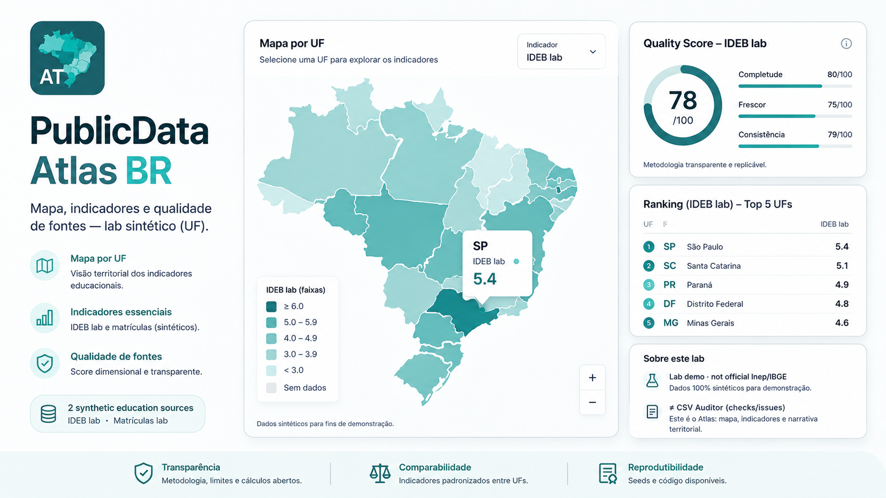
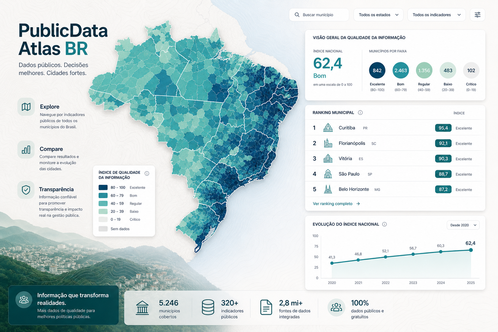
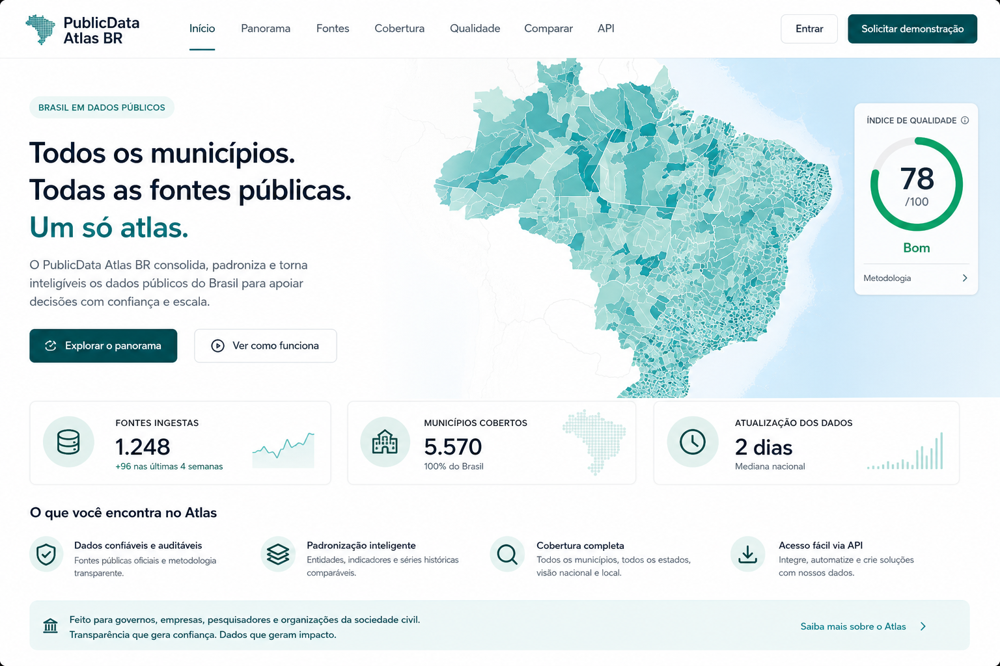
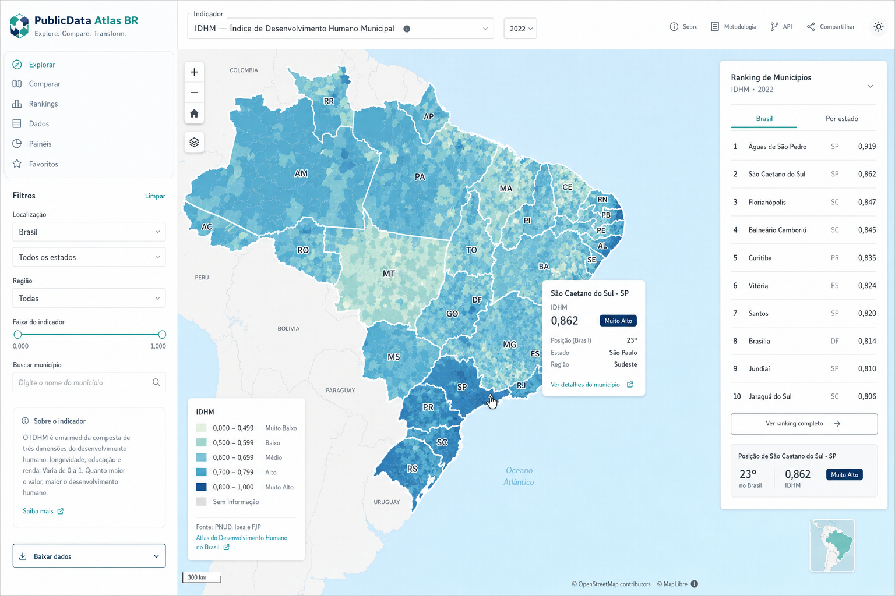

<div align="center">
  
  <h1>PublicData Atlas BR</h1>
  <p><strong>Atlas cívico de dados públicos: qualidade de fontes, indicadores territoriais e relatório metodológico.</strong></p>
  <p><em>Civic open-data atlas: source quality, territorial indicators and methodological reporting.</em></p>
  <p>
    <a href="https://publicdata-atlas-br.vercel.app"><strong>Live Demo</strong></a> ·
    <a href="#problema">Problema</a> ·
    <a href="#solução">Solução</a> ·
    <a href="#stack">Stack</a> ·
    <a href="#quick-start">Quick Start</a> ·
    <a href="#o-que-este-projeto-demonstra">Portfólio</a>
  </p>
  <p>
    
    
    
    
    
  </p>
</div>

<p align="center">
  
</p>

---

## Status atual

**Lab demo pública** com domínio **educação (UF)**, 2 fontes sintéticas, Quality Score dimensional, mapa esquemático, ranking e relatório com limitações explícitas.

- Live: https://publicdata-atlas-br.vercel.app  
- Escopo deliberadamente estreito (1 domínio, 1 pergunta forte)  
- **Não** é publicação oficial Inep/IBGE  

---

## Problema

Dados públicos brasileiros são úteis, mas frequentemente:
- fragmentados e mal documentados;
- consumidos sem score de qualidade;
- transformados em mapas/rankings sem nota metodológica;
- confundidos com “verdade oficial” quando são recortes frágeis.

---

## Solução

O **PublicData Atlas BR** transforma fontes versionadas em uma leitura territorial navegável:

1. seeds/ingestão versionada  
2. Quality Score dimensional (completude, frescor, consistência, cobertura, linhagem)  
3. indicadores + ranking metodológico  
4. mapa (lab: esquemático)  
5. relatório público com limites  

### Atlas ≠ Auditor

| | **Atlas (este repo)** | **Public Data Quality Auditor BR** |
|---|---|---|
| Foco | Mapa + indicadores + narrativa | Checks + score + issues em CSV |
| Saída | Exploração territorial / relatório | Diagnóstico de qualidade / datapackage |

---

## Principais funcionalidades

- Briefing com KPIs de cobertura e quality médio  
- Mapa esquemático por UF (teclado + clique)  
- Ranking IDEB lab com lacunas explícitas  
- Painel de Quality Score por fonte  
- Relatório metodológico bilingue (PT/EN)  
- Notice de responsible open data sempre visível  

---

## Arquitetura

```text
PublicData-Atlas-BR/
├── frontend/                 # Next.js lab demo (Vercel)
│   └── src/
│       ├── app/              # layout + page
│       ├── components/       # map, ranking, quality, report
│       └── lib/demo-data.ts  # seeds + score + ranking
├── backend/                  # FastAPI opcional (meta/quality)
├── data/seed/                # CSV/JSON sintéticos
├── docs/                     # auditoria, arquitetura, handoff
└── .github/workflows/ci.yml
```

Detalhes: [`docs/ARCHITECTURE.md`](./docs/ARCHITECTURE.md)

---

## Stack

- **Frontend:** Next.js 15, React 19, TypeScript  
- **Backend (opcional):** FastAPI, Pytest  
- **Qualidade:** score dimensional compartilhado TS/Python  
- **Deploy:** Vercel (`frontend/`)  

---

## Quick Start

### Pré-requisitos
Node 20+, Python 3.10+ (só se for usar a API), Git.

### Lab demo (recomendado)

```bash
cd frontend
npm install
npm run dev
```

Abra http://localhost:3000 — ou use `start.bat` na raiz (Windows).

### API opcional

```bash
cd backend
python -m venv .venv
.venv\Scripts\activate
pip install -r requirements.txt
cd ..
# Windows
backend\.venv\Scripts\python.exe -m uvicorn backend.main:app --reload --port 8000
```

---

## Variáveis de ambiente

Copie `.env.example`. A demo pública **não exige secrets**.

```env
NEXT_PUBLIC_API_BASE=http://127.0.0.1:8000   # opcional
```

Nunca commite `.env` / tokens.

---

## Testes

```bash
# Frontend
cd frontend && npm test && npm run typecheck && npm run build

# Backend
PYTHONPATH=. pytest backend/tests -q
```

Ver [`docs/TESTING.md`](./docs/TESTING.md).

---

## Decisões técnicas e trade-offs

- Demo **frontend-seeded** para estabilidade no Vercel  
- Mapa **esquemático** (não geometria IBGE) no lab  
- Pesos de quality documentados e espelhados em Python  
- Escopo MVP: 1 domínio, não “Brasil inteiro”  

Ver [`docs/TECHNICAL_DECISIONS.md`](./docs/TECHNICAL_DECISIONS.md).

---

## Roadmap

- [x] Lab demo educação UF + quality + mapa + relatório  
- [x] CI + testes essenciais + docs de portfólio  
- [ ] MapLibre + geometria IBGE simplificada  
- [ ] Ingestão DuckDB bronze→gold com fontes reais versionadas  
- [ ] Páginas por UF + série temporal  
- [ ] Diff entre coletas / alertas de frescor  

---

## O que este projeto demonstra

- Produto de dados cívico com **limites honestos**  
- Score de qualidade **explicável**  
- Storytelling territorial (mapa + ranking + relatório)  
- Full-stack leve (Next + FastAPI opcional)  
- DX: CI, testes, docs, deploy público  

---

## Como eu apresentaria em entrevista

1. **Problema:** dados abertos sem qualidade → decisão frágil.  
2. **Escolha de escopo:** 1 domínio / 1 pergunta (educação UF).  
3. **Diferenciação:** Atlas (leitura) vs Auditor (checks).  
4. **Demo:** mapa → ranking → quality → relatório e lacunas.  
5. **Trade-offs:** seeds sintéticos + mapa esquemático para publicar rápido e estável.  
6. **Próximo passo:** geometria real + ingestão versionada DuckDB.  

---

## Screenshots

<p align="center">
  
  
</p>

---

## Documentação

- [`docs/AUDIT_REPORT.md`](./docs/AUDIT_REPORT.md)  
- [`docs/ARCHITECTURE.md`](./docs/ARCHITECTURE.md)  
- [`docs/TECHNICAL_DECISIONS.md`](./docs/TECHNICAL_DECISIONS.md)  
- [`docs/TESTING.md`](./docs/TESTING.md)  
- [`docs/DEPLOYMENT.md`](./docs/DEPLOYMENT.md)  
- [`docs/methodology.md`](./docs/methodology.md)  
- [`docs/HANDOFF.md`](./docs/HANDOFF.md)  

---

## Autor

**Felipe Alirio Baruja** — [Portfolio](https://barujafe.vercel.app/) · [GitHub](https://github.com/BarujaFe1) · [LinkedIn](https://www.linkedin.com/in/barujafe/)

## Licença

MIT — ver [`LICENSE`](./LICENSE).
