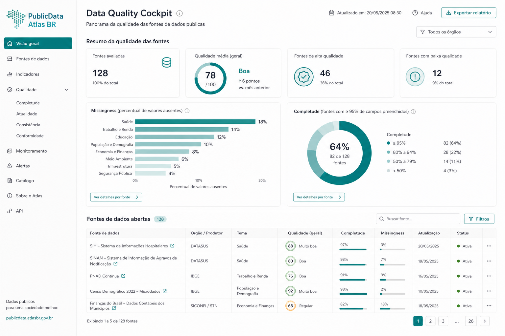
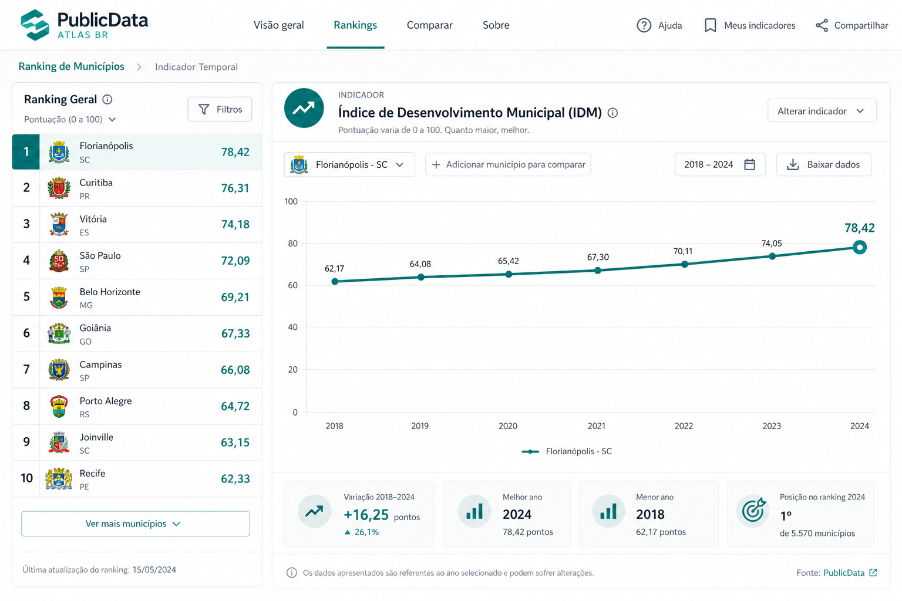
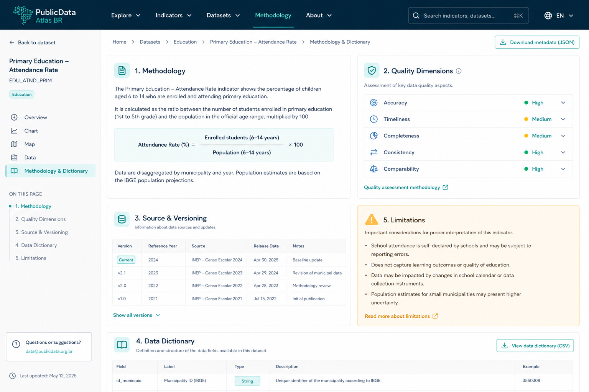
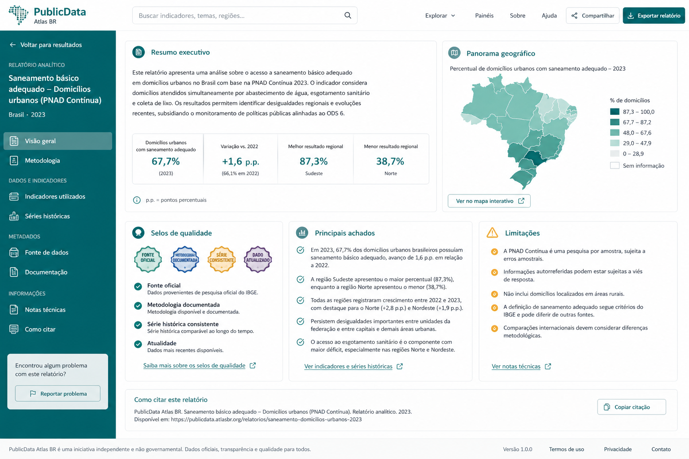
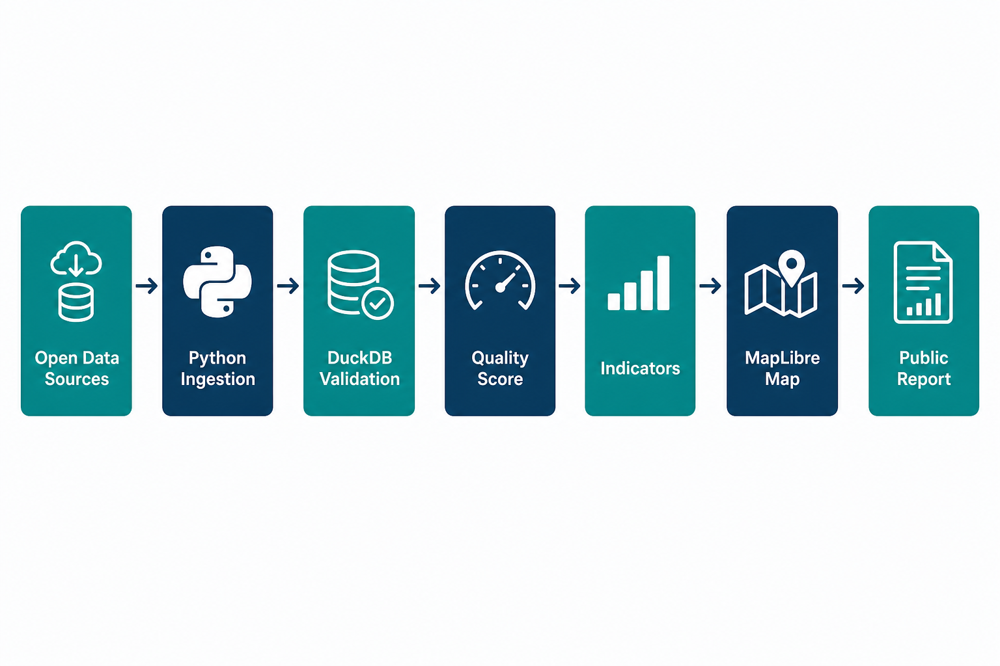

<div align="center">
  

  <h1>PublicData Atlas BR</h1>

  <p><strong>Ingestão, qualidade, geovisualização e narrativa responsável para dados públicos brasileiros.</strong></p>
  <p><strong>Ingestion, quality scoring, geovisualization and responsible storytelling for Brazilian open data.</strong></p>

  <p>
    <a href="#-live-demo"><strong>Live Demo</strong></a> •
    <a href="#-visão-geral--overview">PT-BR / English Overview</a> •
    <a href="#-product-preview">Preview</a> •
    <a href="#-screenshots">Screenshots</a> •
    <a href="#-stack--tecnologias">Stack</a> •
    <a href="#-arquitetura--architecture">Architecture</a> •
    <a href="#-quick-start--início-rápido">Quick Start</a> •
    <a href="#-autor--author">Author</a>
  </p>

  <p>
    <a href="https://publicdata-atlas-br.vercel.app"></a>
    
  </p>

  <p>
    
    
    
    
    
    
    
  </p>
</div>

<p align="center">
  
</p>

---

## 🌐 Live Demo

**Demo pública (lab):** [https://publicdata-atlas-br.vercel.app](https://publicdata-atlas-br.vercel.app)

O que a demo inclui hoje:
- 2 fontes sintéticas de educação (UF) com **Quality Score** dimensional
- **Mapa esquemático** + ranking metodológico (IDEB lab)
- **Relatório metodológico** curto com limitações explícitas
- Diferenciação clara vs [Public Data Quality Auditor BR](https://github.com/BarujaFe1/public-data-quality-auditor-br) (Atlas = mapa/indicadores; Auditor = checks/issues)

> Lab demo com dados sintéticos. Não é publicação oficial Inep/IBGE.

---

## 1. Visão Geral / Overview

O **PublicData Atlas BR** é um produto público criado para transformar dados abertos brasileiros fragmentados em um atlas analítico navegável: com qualidade explícita, indicadores rastreáveis, mapa interativo e relatório metodológico.

Ele organiza um fluxo de **ingestão, validação, pontuação de qualidade, construção de indicadores, geovisualização, ranking metodológico e publicação de relatório**. Em vez de tratar CSVs e APIs públicas como arquivos isolados, o Atlas os converte em um produto cívico com linhagem, lacunas e limites de interpretação.

O projeto foi desenvolvido por **Felipe Alirio Baruja** como peça de portfólio, combinando engenharia de dados, produto analítico e civic-tech visual.

> **Responsible Open Data Notice**  
> O PublicData Atlas BR foi criado para exploração agregada, auditoria de qualidade e apoio à leitura pública de dados. Ele **não deve** ser usado para ranquear pessoas, automatizar sanções individuais ou substituir análise institucional oficial.

---

## ✨ Product Preview

<p align="center">
  
</p>

O Atlas apresenta uma experiência civic-tech premium: mapa do Brasil, Quality Score por fonte, indicadores temporais, explorer municipal, selos de qualidade e narrativa editorial com metodologia transparente.

---

## 2. Por que este projeto importa? / Why this project matters

* **Dados públicos são úteis, mas frágeis:** fontes mudam, schemas quebram e métricas chegam sem contexto.
* **Decisão sem qualidade é risco:** gestores, jornalistas e pesquisadores precisam ver lacunas, não só gráficos bonitos.
* **Geovisualização com governança:** mapa e ranking só fazem sentido com dicionário, versão da fonte e limites explícitos.
* **Produto, não notebook:** o Atlas demonstra ingestão real, qualidade, UI e documentação em um artefato público memorável.

---

## 🧠 O diferencial do PublicData Atlas BR / What makes it different

### Português
O PublicData Atlas BR não é apenas um dashboard de dados abertos. Ele combina qualidade de fonte, indicadores metodológicos e geovisualização em uma experiência rastreável.

Ele mostra não apenas o valor do indicador, mas também:
- quão confiável a fonte está;
- o que foi validado ou sinalizado;
- quais lacunas geográficas ou temporais existem;
- como o ranking foi construído;
- onde a interpretação precisa ser limitada;
- qual versão da fonte alimentou o recorte.

### English
PublicData Atlas BR is not just an open-data dashboard. It combines source quality, methodological indicators and geovisualization into one traceable experience.

It shows not only indicator values, but also:
- how reliable each source is;
- what was validated or flagged;
- which geographic or temporal gaps exist;
- how rankings were constructed;
- where interpretation must be limited;
- which source version powered the view.

---

## 🎯 Problema que resolve / The problem it solves

Em fluxos reais de dados públicos brasileiros, é comum encontrar:
- fontes fragmentadas e mal documentadas;
- schemas instáveis entre coletas;
- indicadores sem definição clara;
- mapas sem nota metodológica;
- rankings sem transparência de cálculo;
- ausência de score de qualidade por fonte;
- relatórios que mostram números sem explicar limites;
- dificuldade de comparar municípios/estados com contexto.

O **PublicData Atlas BR** cria uma camada organizada entre o dado aberto bruto e a leitura analítica pública.

---

## 🧩 Proposta / Analytical Pipeline

O Atlas processa fontes abertas e entrega indicadores, qualidade, mapa e relatório:

```txt
Open Data Sources (CSV / API)
  ↓
Python ingestion (Pandas / Polars)
  ↓
Schema validation & quality checks
  ↓
DuckDB layers (bronze → silver → gold)
  ↓
Indicators + methodological ranking
  ↓
MapLibre explorer (UF / município)
  ↓
Public report + data dictionary
```

---

## 📸 Screenshots

<table>
  <tr>
    <td width="50%">
      
      <br />
      <sub><strong>Quality Cockpit</strong> — score por fonte, completude, atualidade e alertas de qualidade.</sub>
    </td>
    <td width="50%">
      
      <br />
      <sub><strong>Map Explorer</strong> — coroplético interativo com legenda, tooltip e navegação geográfica.</sub>
    </td>
  </tr>
  <tr>
    <td width="50%">
      
      <br />
      <sub><strong>Ranking & Temporal</strong> — ordenação metodológica e série histórica do indicador.</sub>
    </td>
    <td width="50%">
      
      <br />
      <sub><strong>Methodology & Dictionary</strong> — notas metodológicas, versionamento e dicionário de dados.</sub>
    </td>
  </tr>
  <tr>
    <td width="50%">
      
      <br />
      <sub><strong>Public Report</strong> — síntese executiva com achados, mapa, selos e limitações.</sub>
    </td>
    <td width="50%">
      
      <br />
      <sub><strong>Atlas Overview</strong> — briefing inicial com cobertura, frescor e Quality Score.</sub>
    </td>
  </tr>
</table>

---

## 📄 Relatório Público / Public Report

<p align="center">
  
</p>

O relatório público consolida Quality Score, indicadores-chave, mapa, ranking metodológico, dicionário de dados e limitações em um artefato pronto para leitura cívica e portfólio.

---

## 📌 Estudo de Caso / Case Study

### 📌 Estudo de Caso: Educação (MVP)
O MVP foca em **um domínio** (educação) e **uma pergunta forte**, ingerindo **2–3 fontes** abertas versionadas. O pipeline valida schema, calcula Quality Score por fonte, materializa indicadores em DuckDB, publica mapa/ranking e documenta lacunas.

A proposta evita cobrir o Brasil inteiro em todos os temas no primeiro release. Controle de risco: domínio único, fontes versionadas e metodologia transparente.

### 📌 Case Study: Education (MVP)
The MVP focuses on **one domain** (education) and **one strong question**, ingesting **2–3** versioned open sources. The pipeline validates schemas, computes per-source Quality Scores, materializes indicators in DuckDB, publishes map/ranking views and documents gaps.

It deliberately avoids nationwide multi-domain coverage in the first release. Risk control: single domain, versioned sources and transparent methodology.

---

## 🧭 Visual Story / Jornada Analítica

A experiência do Atlas foi pensada como uma jornada cívica guiada:
```txt
1. Abrir o briefing do domínio (educação) e ver cobertura + Quality Score
2. Inspecionar o Quality Cockpit por fonte
3. Explorar o mapa interativo (UF → município)
4. Ler o ranking metodológico e a série temporal
5. Abrir metodologia e data dictionary
6. Exportar / ler o relatório público com limitações explícitas
```

---

## ⚙️ Funcionalidades Principais / Core Features

### Atlas Briefing
Painel inicial com domínio ativo, volume ingerido, cobertura geográfica, frescor das fontes e badges de qualidade.

### Source Quality Score
Pontuação explicável por fonte (completude, atualidade, consistência, cobertura e rastreabilidade).

### Map Explorer
Mapa interativo (MapLibre) com coroplético, legenda e navegação por município/estado.

### Methodological Ranking
Ranking com regra documentada — não é “score mágico”, é indicador com nota metodológica.

### Temporal Indicators
Série histórica para acompanhar tendência e quebras de série.

### Public Report + Data Dictionary
Relatório legível + dicionário de campos, versões de fonte e limites de uso.

---

## 🛠️ Stack / Tecnologias

### Frontend
- **Framework:** Next.js 15 (App Router) & React 19
- **Linguagem:** TypeScript
- **Mapas:** MapLibre GL
- **Estilização:** CSS moderno / design civic-tech

### Backend & Dados
- **API:** FastAPI & Uvicorn (Python)
- **Processamento:** Pandas / Polars
- **Analytics store:** DuckDB (camadas bronze/silver/gold)
- **Qualidade:** checks dimensionais + score explicável
- **Testes:** Pytest
- **Deploy alvo:** Vercel (web) + jobs via GitHub Actions/cron

---

## 🧱 Arquitetura / Architecture

O projeto adota monorepo desacoplado:

```text
PublicData-Atlas-BR/
├── frontend/                    # Next.js (App Router)
│   └── src/app/                 # Páginas do atlas
├── backend/                     # FastAPI + serviços
│   ├── main.py                  # Health / meta
│   ├── services/                # Quality score e helpers
│   ├── ingestion/               # Conectores de fontes
│   └── tests/                   # Pytest
├── data/
│   ├── raw/ bronze/ silver/ gold/
│   └── seed/                    # Seeds controladas
├── docs/                        # Metodologia e dicionário
├── assets/                      # Ícone, hero, screenshots
├── scripts/                     # Utilitários
├── start.bat                    # Bootstrap local (Windows)
└── README.md
```

---

## 🧱 Visual Architecture

<p align="center">
  
</p>

PublicData Atlas BR follows a traceable civic-data flow: open sources enter ingestion, get validated and scored, land in DuckDB layers, become indicators and maps, then ship as a public methodological report.

---

## 🔁 Data Flow Pipeline

```txt
Raw Open Data
  ↓
Ingestion + source versioning
  ↓
Schema validation
  ↓
Quality dimensions & Quality Score
  ↓
Bronze → Silver → Gold (DuckDB)
  ↓
Indicators + ranking rules
  ↓
MapLibre / municipal explorer
  ↓
Public report / dictionary / portfolio narrative
```

---

## 🚀 Quick Start / Início Rápido

### Pré-requisitos
- **Node.js** v20 ou superior
- **Python** v3.10+ (preferencialmente 3.12)
- **Git**

### Opção 1 — Lab demo (recomendado)
Na pasta raiz:
```bash
start.bat
```
Sobe o frontend Next.js da demo lab em [http://localhost:3000](http://localhost:3000).

### Opção 2 — Manual (frontend)
```bash
cd frontend
npm install
npm run dev
```

### Opção 3 — API opcional (meta/quality)
```bash
cd backend
python -m venv .venv
.venv\Scripts\activate            # Windows
pip install -r requirements.txt
cd ..
backend\.venv\Scripts\python.exe -m uvicorn backend.main:app --reload --port 8000
```

A **demo pública na Vercel** é frontend-only (seeds embutidos). A API FastAPI é scaffold local para evolução.

Copie `.env.example` / `frontend/.env.example` conforme necessário. **Nunca** commite segredos.

---

## 🧪 Scripts e Testes / Scripts and Testing

### Backend
```bash
cd backend
.venv\Scripts\python -m pytest
```

### Frontend
```bash
cd frontend
npm run lint
npm run build
```

---

## 📊 Metodologia / Methodology

O Atlas prioriza transparência metodológica:
* **Domínio único no MVP** para controlar escopo
* **Fontes versionadas** (URL, coleta, hash, schema)
* **Quality Score dimensional** (completude, atualidade, consistência, cobertura, linhagem)
* **Ranking com regra explícita** e limitações publicadas
* **Sem PII individual** no recorte analítico

Detalhes em [`docs/methodology.md`](./docs/methodology.md) e [`docs/data-dictionary.md`](./docs/data-dictionary.md).

---

## 🛡️ Segurança, Ética e Boas Práticas

* **Agregados públicos** — foco em indicadores territoriais, não indivíduos
* **Segredos fora do Git** — `.env*` ignorado; apenas `.env.example`
* **Limites visíveis** — lacunas e quebras de série aparecem no produto
* **Antiescopo claro** — não é portal oficial do governo nem motor de decisão automatizada sobre pessoas

---

## 🧭 Roadmap do Produto

* **MVP:** 1 domínio, 2–3 fontes, qualidade, indicadores, mapa, ranking, relatório
* **Fase 2:** mais fontes, atualização periódica, páginas por município/UF, diff temporal, alertas de atualização
* **Fase 3:** API pública, download tratado, comparação entre fontes, colaboração comunitária
* **Fora de escopo do MVP:** cobrir o Brasil inteiro em todos os temas

---

## 💼 Valor para Portfólio / Portfolio Value

O PublicData Atlas BR demonstra competências para **Analytics Engineering, Data Product e Civic Tech**:
- ingestão de dados reais bagunçados;
- qualidade e governança de fontes;
- geovisualização e storytelling;
- documentação metodológica;
- produto público memorável e socialmente relevante.

---

## 📚 Documentação Complementar

- [docs/methodology.md](./docs/methodology.md) — pipeline, pesos de qualidade e limites
- [docs/data-dictionary.md](./docs/data-dictionary.md) — campos do modelo analítico
- [docs/portfolio-pitch.md](./docs/portfolio-pitch.md) — narrativa de portfólio

---

## 🖼️ GitHub Social Preview

Uma imagem para visualização social está disponível em:
```txt
assets/social-preview.png
```
*Dimensão recomendada: 1280x640, &lt;1MB. Faça upload em: Repository Settings → Social Preview.*

---

## 🔖 GitHub Repository Metadata

### About sugerido
```txt
Brazilian open-data atlas: ingest, validate, score quality, map indicators and publish methodological public reports.
```

### Topics sugeridos
```txt
open-data
civic-tech
brazil
data-quality
geovisualization
maplibre
duckdb
fastapi
nextjs
typescript
python
analytics-engineering
portfolio-project
public-data
education-data
```

---

## 👤 Autor / Author

Desenvolvido por **Felipe Alirio Baruja**.

- **Portfolio:** [barujafe.vercel.app](https://barujafe.vercel.app/)
- **GitHub:** [@BarujaFe1](https://github.com/BarujaFe1)
- **LinkedIn:** [Gustavo Felipe Alirio Baruja](https://www.linkedin.com/in/barujafe/)

---

## 📄 Licença / License

MIT License. Copyright (c) 2026 Felipe Alirio Baruja.

Veja o arquivo [`LICENSE`](./LICENSE).
